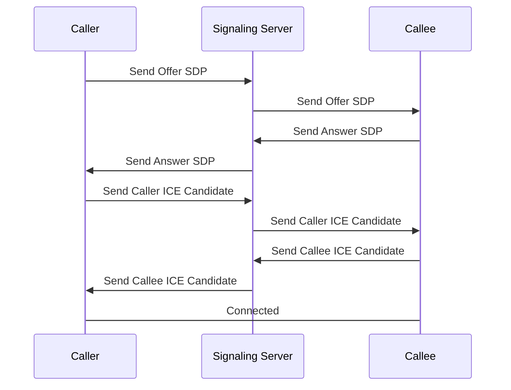

# WebRTC Example
WebRTC을 공부하면서 만들어본 간단한 예제입니다.  
WebRTC가 어떻게 구현되는지, 피어 간 연결은 어떻게 수립되는지 볼 수 있습니다.  
간단한 예제라 예외처리는 완벽하게 하지 않았습니다.  
서버 콘솔, 클라이언트 개발자도구 콘솔로 로그를 확인할 수 있습니다.

## Files
index.js : 웹서버, 시그널링서버 구현  
create.js, html : Caller 측 구현  
join.js, html : Callee 측 구현  

## Usage
1. `npm install` 로 의존성 패키지를 설치합니다.
2. `npm start` or `node index.js` 로 실행합니다.  
CALLER : `localhost:8081/create`  
CALLEE : `localhost:8081/join`
으로 접속합니다.

## Dependency
- express (https://github.com/expressjs/express)
- socket.io (https://github.com/socketio/socket.io)

## Note
### 용어정리
- Caller : 세션을 개최하는 클라이언트, 방 만드는 클라이언트
- Callee : 세션에 참가하는 클라이언트, 방에 입장하는 클라이언트
- SDP : **S**ession **D**escription **P**rotocol, WebRTC에서 스트리밍 미디어의 해상도,  
코덱등의 멀티미디어 초기인수를 기술하기 위한 프로토콜  
- Offer SDP (제안 SDP) : Caller가 Callee에게 전송하는 SDP
- Answer SDP (응답 SDP) : Callee가 Caller에게 전송하는 SDP
- ICE : **I**nteractive **C**onnectivity **E**stablishment, 브라우저가 피어 간 연결을 수립할 수 있게 해주는 프레임워크.
- ICE Candidates : ICE로 알아낸 클라이언트와 통신가능한 연결 후보들

WebRTC는 기본적으로 미디어 스트리밍 시 서버를 두고 통신하지 않습니다.  
피어 간 직접연결(P2P)을 통해 통신합니다.  
또한, 클라이언트의 네트워크 환경은 다 다릅니다.  
따라서 피어 간 연결(P2P)이 방화벽이나 다른이유로 막힐 수 있기때문에  
네트워크 제한을 파악해야합니다.  
이를 STUN 프로토콜로 확인합니다.  
> **STUN**  
**S**ession **T**raversal **U**tilities for **NAT**, 클라이언트의 공개주소를 알아내거나  
피어 간 연결을 방해하는 제한요소를 확인하는 프로토콜

피어 간 연결이 불가능할때의 예방책으로 스트리밍 데이터를 중계해주는 서버를 통해 스트리밍이 가능하게 합니다. 이를 TURN 서버라고 합니다.  
> **TURN**  
**T**raversal **U**sing **R**elays around **NAT**, 피어 간 직접연결이 불가능할때  
스트리밍 데이터를 중계해주는 서버

P2P가 가능할때의 연결과정을 요약하면 다음과 같습니다.

이러한 과정을 시그널링(Signaling) 이라고하며, 시그널링 서버의 구현은 WebRTC 사양에 포함되지 않습니다.

## Reference
- WebRTC (https://webrtc.org/)
- MDN Web Docs WebRTC (https://developer.mozilla.org/ko/docs/Web/API/WebRTC_API/Protocols)
- WebRTC란 무엇인가?(2) : ICE, SDP, Signalling by gojaegaebal (https://velog.io/@gojaegaebal/210307-%EA%B0%9C%EB%B0%9C%EC%9D%BC%EC%A7%8090%EC%9D%BC%EC%B0%A8-%EC%A0%95%EA%B8%80-%EB%82%98%EB%A7%8C%EC%9D%98-%EB%AC%B4%EA%B8%B0-%ED%94%84%EB%A1%9C%EC%A0%9D%ED%8A%B8-WebRTC%EB%9E%80-%EB%AC%B4%EC%97%87%EC%9D%B8%EA%B0%802-ICE-SDP-Signalling)
- ICE의 이해 by 라인하트 (https://brunch.co.kr/@linecard/156)
- [WebRTC] 웹브라우저로 화상 채팅을 만들 수 있다고? by ehdrms2034 (https://velog.io/@ehdrms2034/WebRTC-%EC%9B%B9%EB%B8%8C%EB%9D%BC%EC%9A%B0%EC%A0%80%EB%A1%9C-%ED%99%94%EC%83%81-%EC%B1%84%ED%8C%85%EC%9D%84-%EB%A7%8C%EB%93%A4-%EC%88%98-%EC%9E%88%EB%8B%A4%EA%B3%A0)
- WebRTC를 공부하며 스트리밍 과정 익히기 by GaGah (https://gh402.tistory.com/47)
- WebRTC SDP by Heo Young Nam (https://cryingnavi.github.io/webrtc/2016/12/30/WebRTC-SDP.html)

